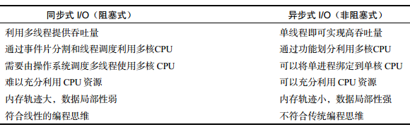

Node.js 开发指南
==========

## 第1章  Node.js 简介

## 第3章  Node.js 快速入门

### 3.1 开始用 Node.js 编程
* `node --help` 查看帮助信息
* REPL(Read-Eval-Print Loop)：输入-求值-输出 循环。终端运行无参数的 node 将会启动一个 JS 的交互式 shell
* 两次 Ctrl + C 可退出 Node.js 的 REPL 模式
* PHP 网络架构：浏览器 - HTTP 服务器(Apache、IIS etc.) - PHP 解析器
* Node.js 网络架构：浏览器 - Node
* `http.creatServer().listen(3000)`：listen 函数中创建了事件监听器，使得 Node.js 进程不会退出事件循环
* 使用 `supervisor` 监视代码改动，并自动重启 Node.js:`npm install -g supervisor`

### 3.2 异步式 IO 与事件式编程
* 阻塞(block)：线程在执行中如果遇到磁盘读写或网络通信（统称为 I/O 操作），
通常要耗费较长的时间，这时操作系统会剥夺这个线程的 CPU 控制权，使其暂停执行，同
时将资源让给其他的工作线程，这种线程调度方式称为 阻塞
* 同步式I/O(Synchronous I/O)/阻塞式I/O(Blocking I/O)
* 异步式I/O(Asynchronous I/O)/非阻塞式IO(Non-blocking I/O)
* 同步式 I/O 与异步式 I/O 的特点比较：

* 在 Node.js 中，异步式 I/O 是通过回调来实现的
* Node.js 所有的异步 I/O 操作在完成时都会发送一个事件到事件队列。事件由 EventEmitter 对象提供
* Node.js 的事件循环机制
    - Node.js 在什么时候会进入事件循环呢？答案是 Node.js程序由事件循环开始，到事件循环结束，所有的逻辑都是事件的回调函数，所以 Node.js 始终在事件循环中，程序入口就是事件循环第一个事件的回调函数。事件的回调函数在执行的过程中，可能会发出 I/O 请求或直接发射（emit）事件，执行完毕后再返回事件循环，事件循环会检查事件队列中有没有未处理的事件，直到程序结束
    - Node.js 没有显式的事件循环，其事件循环对开发者不可见，由 libev 库实现

### 3.3 模块和包
* 在浏览器 JS 中，脚本模块的拆分和组合通常使用 HTML 的 script 标签实现
* Node.js 提供了 require 函数来调用其他模块，而且模块都是基于文件的
* 什么是模块？模块式 Node.js 应用程序的基本组成部分，文件和模块是一一对应的。换言之，一个 Node.js 文件就是一个模块，这个文件可能是 JS 代码、JSON 或者编译过的 C/C++ 扩展
* P44

## JavaScript 的高级特性
* P163