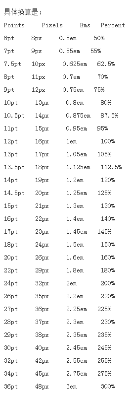

设计图和页面字体大小还原处理方法
==========

## 操作步骤
1. UI 图标注尺寸时使用 `pt` 为单位
2. 手机端字体换算按照设计规范对照换算表计算设置字体大小(见第3条)
3. 换算方法：根据 `pt` 尺寸找到对应的 `px` 尺寸，`px` 尺寸 / 2 = 手机端对应尺寸
4. PC 端直接把 `pt` 尺寸当做 `px` 尺寸(即不做任何转换)

## 换算表

## 参考